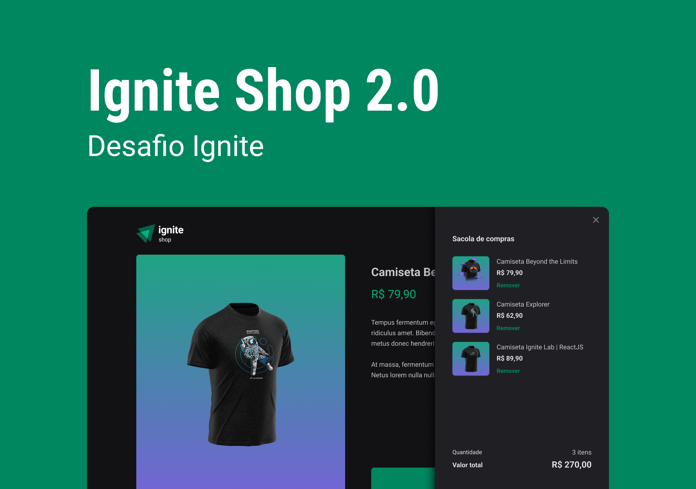

## Projeto Ignite Shop

Projeto criado com o framework Nextjs. Utilizando Stitches.JS, bibliotheca para estilização de CSS in JS. Abordando os conceitos de server-side rendering(SSR) e static-site generation (SSG).

### 🛠️ Nesse projeto foi utilizado

* Next
* Stitches
* Radix
* Stripe
* TypeScript

## 🚀 Como executar

**Para que esse projeto funcione corretamente, é preciso estar com o servidor rodando.**

- Instale os pacotes com `npm install ou yarn`.
- Execute `npm run dev ou yarn dev` para iniciar o cliente web.
- Faça uma copia do arquivo `.env.example` para `.env` e preencha corretamente com as informações de acordo com as APIs keys do Stripe.